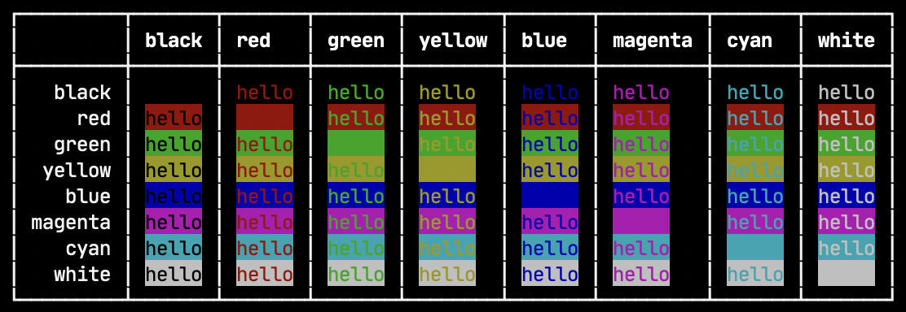

# prolog



## use

```js
import prolog from "@qzda/prolog";
import { Colors, Backgrounds } from "@qzda/prolog/config";

const table = Object.keys(Backgrounds).reduce((obj, bg) => {
  if (!bg.startsWith("bright")) {
    obj[bg] = {};
    Object.keys(Colors).forEach((color) => {
      if (!color.startsWith("bright")) {
        obj[bg][color] = prolog({
          msg: "hello",
          bg,
          color,
        });
      }
    });
  }
  return obj;
}, {});

console.table(table);
```
